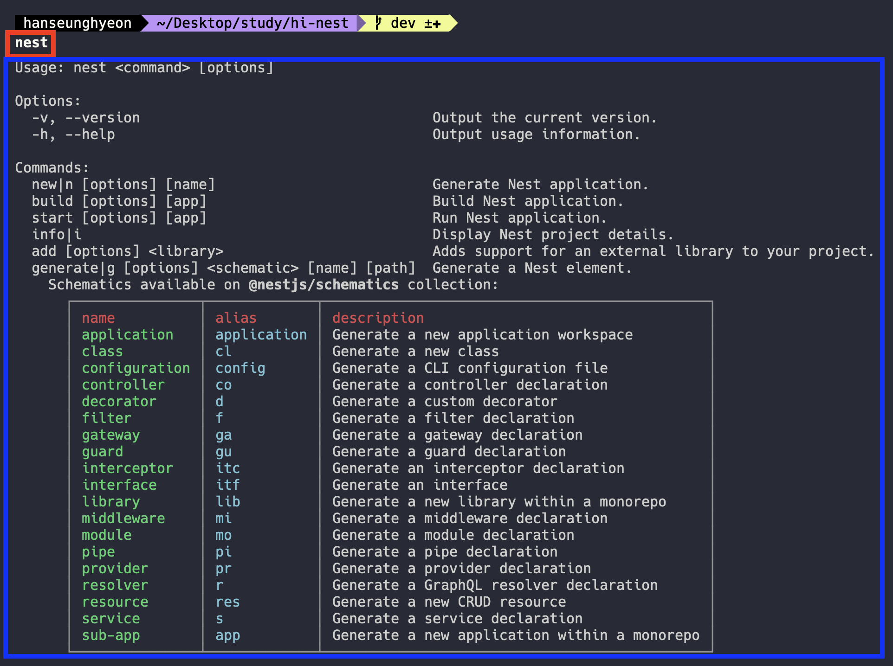
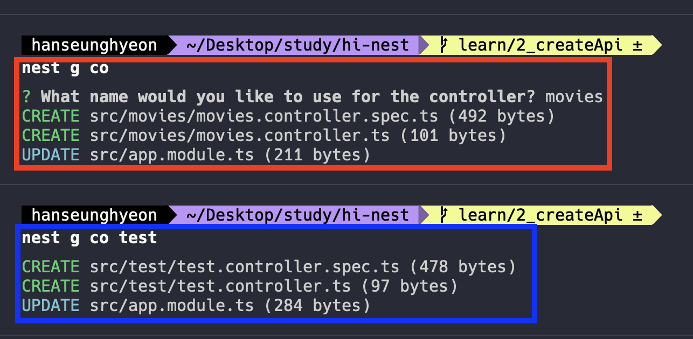

# nest command

- this document is about nest command

## how to show command
- type to shell 'nest'
```shell
nest
```




## how to create controller
- purpose of use to controller
  - mapping url
  - pass parameters, queries, etc.
- how to create controller
  - type to shell 'nest g co'
  - type to shell 'nest g co ${name}'
```shell
nest g co
```
```shell
nest g co name
```


## how to create service
- purpose of use to service
  - business logic
  - database access
- how to create service
  - type to shell 'nest g s'
  - type to shell 'nest g s ${name}'
```shell
nest g s
```
```shell
nest g s name
```